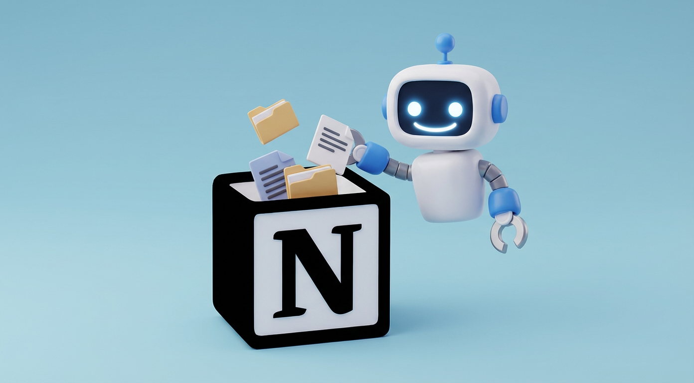

<div align="center">
  
  
  # NotionMate - AI-Powered Learning Companion

  [](https://www.python.org/)
  [](https://streamlit.io/)
  [](https://langchain.com/)
</div>

## 📋 Table of Contents
- [Problem Statement](#-problem-statement)
- [Solution](#-solution)
- [Architecture](#-architecture)
- [Notion Agent Workflow](#-notion-agent-workflow)
- [Setup Instructions](#-setup-instructions)
- [Usage](#-usage)
- [Technology Stack](#-technology-stack)

---

## 🎯 Problem Statement

Modern learners extensively use AI chatbots for education, acquiring knowledge on various topics ranging from technical concepts to life skills. However, a critical gap exists in knowledge retention and organization:

### The Challenge:
- **Manual Summarization**: Users must explicitly ask chatbots to summarize conversations and manually copy content
- **Complex Content Loss**: Formulas, code snippets, and formatted content often break during manual copying
- **Knowledge Fragmentation**: Learned information gets lost in chat histories, requiring tedious searching to retrieve
- **Low Retention**: The friction of manual storage discourages users from archiving valuable knowledge
- **Time-Consuming**: Switching between chat interface, summarization, and note-taking apps disrupts learning flow

This leads to a cycle of **learning, forgetting, and re-searching** instead of **learning, storing, and applying**.

---

## 💡 Solution

**NotionMate** bridges the gap between learning and knowledge management with a **one-click solution** to transform chat conversations into organized Notion notes.

### Key Features:
✅ **One-Click Export**: Single button press to save conversation summaries to Notion  
✅ **Smart Categorization**: Choose from predefined Notion pages (Technical Knowledge, Life Lessons, Health Tips, Jokes, etc.)  
✅ **Intelligent Summarization**: AI-powered extraction of key points and main concepts  
✅ **Visual Enhancement**: Automatic relevant image search via Serper API and embedding  
✅ **Format Preservation**: Maintains formulas, code blocks, and complex formatting  
✅ **RAG-Enhanced Chat**: Upload PDFs to create a context-aware knowledge base for conversations  
✅ **Groq-Powered Responses**: Fast and cost-effective API calls using LiteLLM with Groq

### Workflow:
1. Have a conversation with the AI chatbot (with or without uploaded PDFs)
2. Select target Notion page from dropdown menu
3. Click "Write to Notion" button
4. System automatically:
   - Summarizes the entire conversation
   - Extracts key learning points
   - Finds a relevant cover image
   - Formats content with proper Notion blocks
   - Writes to your selected Notion page

---

## 🏗️ Architecture

<div align="center">
  
</div>

### Detailed Architecture Flow

```
┌─────────────────────────────────────────────────────────────────┐
│                        STREAMLIT UI (main.py)                   │
│  ┌──────────────┐  ┌──────────────┐  ┌────────────────────┐   │
│  │ Chat Interface│  │ PDF Upload   │  │ Write to Notion    │   │
│  │              │  │              │  │ [Button + Dropdown] │   │
│  └──────┬───────┘  └──────┬───────┘  └─────────┬──────────┘   │
└─────────┼──────────────────┼────────────────────┼──────────────┘
          │                  │                    │
          ▼                  ▼                    ▼
┌─────────────────────────────────────────────────────────────────┐
│                      MAIN APPLICATION LAYER                      │
│  ┌──────────────────────────────────────────────────────────┐  │
│  │              RAG CHATBOT (LangChain + Groq)             │  │
│  │  ┌────────────────┐  ┌─────────────┐  ┌──────────────┐ │  │
│  │  │ Vector Store   │→ │ Retriever   │→ │ LLM (Groq)   │ │  │
│  │  │ (Chroma DB)    │  │ (RAG Chain) │  │ via LiteLLM  │ │  │
│  │  └────────────────┘  └─────────────┘  └──────────────┘ │  │
│  │         ▲                                                │  │
│  │         │                                                │  │
│  │  ┌──────┴──────────────────────────────────────────┐   │  │
│  │  │  Memory Creator (memory_creator.py)             │   │  │
│  │  │  - PDF Loader → Text Splitter → Embeddings     │   │  │
│  │  │  - HuggingFace (all-mpnet-base-v2)              │   │  │
│  │  └─────────────────────────────────────────────────┘   │  │
│  └──────────────────────────────────────────────────────────┘  │
└─────────────────────────────────────────────────────────────────┘
                                │
                                ▼
┌─────────────────────────────────────────────────────────────────┐
│                    NOTION AGENT ORCHESTRATOR                     │
│                  (Google ADK Sequential Agent)                   │
│                                                                   │
│  ┌────────────────────────────────────────────────────────────┐ │
│  │  Agent 1: SUMMARY AGENT (Gemini 2.0 Flash)                │ │
│  │  ├─ Input: Full chat history                              │ │
│  │  └─ Output: Structured summary of key points             │ │
│  └──────────────────────┬─────────────────────────────────────┘ │
│                         ▼                                         │
│  ┌────────────────────────────────────────────────────────────┐ │
│  │  Agent 2: TOPIC AGENT (Gemini 2.0 Flash)                  │ │
│  │  ├─ Input: Summary from Agent 1                           │ │
│  │  └─ Output: 2-4 word topic for image search               │ │
│  └──────────────────────┬─────────────────────────────────────┘ │
│                         ▼                                         │
│  ┌────────────────────────────────────────────────────────────┐ │
│  │  Agent 3: IMAGE SEARCH AGENT (Gemini 2.0 Flash)           │ │
│  │  ├─ Input: Topic from Agent 2                             │ │
│  │  ├─ Tool: Serper API via search_image_from_state_tool     │ │
│  │  └─ Output: Relevant image URL                            │ │
│  └──────────────────────┬─────────────────────────────────────┘ │
│                         ▼                                         │
│  ┌────────────────────────────────────────────────────────────┐ │
│  │  Agent 4: FORMATTER AGENT (Gemini 2.0 Flash)              │ │
│  │  ├─ Input: Summary, Topic, Image URL                      │ │
│  │  ├─ Tool: format_notion_blocks_tool                       │ │
│  │  └─ Output: Notion-compatible block structure             │ │
│  │     (heading, image, divider, bulleted lists)             │ │
│  └──────────────────────┬─────────────────────────────────────┘ │
│                         ▼                                         │
│  ┌────────────────────────────────────────────────────────────┐ │
│  │  Agent 5: WRITER AGENT (Gemini 2.0 Flash)                 │ │
│  │  ├─ Input: Formatted blocks + Target Page ID              │ │
│  │  ├─ Tool: write_to_notion_tool (Notion MCP Server)        │ │
│  │  └─ Output: Write confirmation & Notion page link         │ │
│  └────────────────────────────────────────────────────────────┘ │
│                                                                   │
│  STATE MANAGEMENT: InMemorySessionService (Google ADK)           │
│  - Passes outputs between agents via shared state dictionary     │
│  - Keys: chat_history, summary, topic, image_url, blocks, etc.  │
└─────────────────────────────────────────────────────────────────┘
                                │
                                ▼
┌─────────────────────────────────────────────────────────────────┐
│                    NOTION INTEGRATION LAYER                      │
│  ┌────────────────────────────────────────────────────────────┐ │
│  │        NOTION MCP SERVER (@notionhq/notion-mcp-server)    │ │
│  │  - Standard MCP protocol communication via stdio          │ │
│  │  - Tool: append_block_children (write blocks to pages)    │ │
│  │  - Authentication: NOTION_TOKEN from .env                 │ │
│  └────────────────────────────────────────────────────────────┘ │
│                         ▲                                         │
│                         │ NPX Executable                          │
│                         │                                         │
│  ┌────────────────────────────────────────────────────────────┐ │
│  │   Page Info Retriever (get_notion_pages)                  │ │
│  │   - Tool: list_objects (fetch available Notion pages)     │ │
│  │   - Provides dropdown options in UI                       │ │
│  └────────────────────────────────────────────────────────────┘ │
└─────────────────────────────────────────────────────────────────┘
                                │
                                ▼
                        ┌───────────────┐
                        │  NOTION API   │
                        │  Your Pages   │
                        └───────────────┘
```

### Component Breakdown:

#### 1. **Streamlit UI Layer**
- Main entry point for user interaction
- Handles chat interface, PDF uploads, and Notion integration controls
- Uses `ChatGroq` (via LiteLLM) for fast and cost-effective API responses

#### 2. **RAG Chatbot System**
- **Vector Store**: Chroma DB for persistent document embeddings
- **Embeddings**: HuggingFace `sentence-transformers/all-mpnet-base-v2`
- **Memory Creator**: Converts PDFs to searchable vector embeddings
- **LLM**: Groq API (accessed through LiteLLM for improved compatibility)

#### 3. **Notion Agent Orchestrator**
The core innovation of NotionMate - a sequential agent pipeline using **Google ADK (Agent Development Kit)**:

**Agent Pipeline Flow:**
1. **Summary Agent** → Analyzes full conversation and extracts key learning points
2. **Topic Agent** → Distills summary into a concise 2-4 word topic
3. **Image Search Agent** → Finds relevant cover image using Serper API
4. **Formatter Agent** → Structures content into Notion block format
5. **Writer Agent** → Writes formatted blocks to target Notion page

**All agents use Gemini 2.0 Flash model** for optimal performance and cost efficiency.

**State Management:**
- Uses Google ADK's `InMemorySessionService` for state persistence
- Each agent reads from and writes to shared state dictionary
- Sequential execution ensures data dependencies are met

#### 4. **Notion Integration Layer**
- **Notion MCP Server**: Official `@notionhq/notion-mcp-server` via NPX
- **Communication Protocol**: stdio (standard input/output)
- **Tools Available**:
  - `list_objects`: Retrieve available Notion pages
  - `append_block_children`: Write content blocks to pages
- **Authentication**: Integration token from environment variables

---

## 🔄 Notion Agent Workflow

### Sequential Agent Architecture

The Notion Agent system is built on **Google ADK's Sequential Agent pattern**, where each agent performs a specialized task and passes its output to the next agent in the chain.


<div align="center">
  
</div>

### Detailed Agent Breakdown:

#### **Agent 1: Summary Agent**
- **Model**: Gemini 2.0 Flash
- **Input**: Complete chat conversation history
- **Task**: Extract and structure key learning points
- **Output**: `summary` (comprehensive markdown summary)
- **Prompt Focus**: "Create a well-structured summary capturing all key points and important details"

#### **Agent 2: Topic Agent**
- **Model**: Gemini 2.0 Flash
- **Input**: `summary` from Agent 1
- **Task**: Extract a concise topic suitable for image search
- **Output**: `topic` (2-4 words)
- **Prompt Focus**: "Extract the main topic that works well as an image search query"

#### **Agent 3: Image Search Agent**
- **Model**: Gemini 2.0 Flash
- **Input**: `topic` from Agent 2
- **Task**: Search for visually relevant image using Serper API
- **Tool**: `search_image_from_state_tool`
  - Reads topic from state
  - Calls Serper API
  - Returns high-quality image URL
- **Output**: `image_url` + `image_search_status`

#### **Agent 4: Formatter Agent**
- **Model**: Gemini 2.0 Flash
- **Input**: `summary`, `topic`, `image_url` from previous agents
- **Task**: Convert content into Notion block format
- **Tool**: `format_notion_blocks_tool`
  - Creates heading block with topic
  - Adds image block with URL
  - Inserts divider
  - Converts summary into bulleted list blocks
- **Output**: `notion_blocks` (JSON array) + `format_status`

**Notion Block Structure:**
```json
[
  {"type": "heading_1", "heading_1": {"rich_text": [{"text": {"content": "Topic"}}]}},
  {"type": "image", "image": {"external": {"url": "image_url"}}},
  {"type": "divider", "divider": {}},
  {"type": "bulleted_list_item", "bulleted_list_item": {"rich_text": [{"text": {"content": "Key point 1"}}]}},
  ...
]
```

#### **Agent 5: Writer Agent**
- **Model**: Gemini 2.0 Flash
- **Input**: `notion_blocks` from Agent 4, `notion_page_id` from user selection
- **Task**: Write blocks to specified Notion page
- **Tool**: `write_to_notion_tool`
  - Connects to Notion MCP Server
  - Calls `append_block_children` with page ID and blocks
  - Returns write confirmation
- **Output**: `write_status` (success/failure) + Notion page link

### State Management Flow:

```python
# Initial State
{
  "chat_history": "User: ... Assistant: ...",
  "notion_page_id": "abc123..."
}

# After Agent 1
{
  ...,
  "summary": "The conversation covered..."
}

# After Agent 2
{
  ...,
  "topic": "Python Decorators"
}

# After Agent 3
{
  ...,
  "image_url": "https://images.unsplash.com/...",
  "image_search_status": "Image found successfully"
}

# After Agent 4
{
  ...,
  "notion_blocks": [{...}, {...}],
  "format_status": "Blocks formatted successfully"
}

# After Agent 5
{
  ...,
  "write_status": "Successfully written to Notion",
  "notion_page_url": "https://notion.so/..."
}
```

### Error Handling:
- Each agent validates its input from previous agents
- If any agent fails, the workflow stops and returns error details
- Notion MCP connection errors are caught and reported to user

---

## 🛠️ Setup Instructions

### Prerequisites

1. **Python 3.12+**
2. **Node.js & NPM/NPX** (for Notion MCP Server)
3. **Notion Integration Token** (see below)
4. **Groq API Key** (for LLM responses)
5. **Serper API Key** (for image search)
6. **Google AI API Key** (for Gemini agents)

### Step 1: Clone Repository

```bash
git clone <repository-url>
cd NotionMate-Capstone
```

### Step 2: Create Virtual Environment

```bash
python3.12 -m venv env_notionmate
source env_notionmate/bin/activate  # On Windows: env_notionmate\Scripts\activate
```

### Step 3: Install Dependencies

```bash
pip install -r requirements.txt
```

**Key Dependencies:**
- `streamlit` - Web UI framework
- `langchain` & `langchain-community` - RAG framework
- `langchain-groq` - Groq LLM integration
- `langchain-google-genai` - Gemini model integration
- `litellm` - Unified LLM API interface (enables Groq support)
- `google-adk` - Google Agent Development Kit for sequential agents
- `chromadb` - Vector database for embeddings
- `langchain-huggingface` - HuggingFace embeddings
- `langchain-mcp-adapters` - Model Context Protocol adapters for Notion

### Step 4: Notion MCP Server Setup

The project uses the official **Notion MCP Server** to interact with Notion's API through the Model Context Protocol.

#### Install NPX (if not already installed):
```bash
npm install -g npx
```

#### Locate NPX Path:
```bash
which npx  # On Linux/Mac
where npx  # On Windows
```
Copy this path for the `.env` file.

#### Configure Notion Integration:
Follow the official Notion MCP setup guide to obtain your integration token:

📖 **[Notion MCP Server Setup Guide](https://github.com/makenotion/notion-mcp-server)**

You'll need to:
1. Create a Notion integration at https://www.notion.so/my-integrations
2. Grant the integration access to specific pages
3. Copy the integration token

### Step 5: Environment Variables

Create a `.env` file in the project root:

```env
# Notion Configuration
NOTION_TOKEN=your_notion_integration_token_here
NPX_EXECUTABLE_PATH=/usr/local/bin/npx  # Path from 'which npx' command

# LLM API Keys
GROQ_API_KEY=your_groq_api_key_here
GOOGLE_API_KEY=your_google_ai_api_key_here

# Image Search
SERPER_API_KEY=your_serper_api_key_here
```

**Where to get API keys:**
- **Groq API**: https://console.groq.com/keys (Free tier available)
- **Google AI (Gemini)**: https://makersuite.google.com/app/apikey
- **Serper API**: https://serper.dev/api-key

### Step 6: Set Up Vector Store (Optional - for RAG functionality)

If you want to use the PDF upload feature with RAG:

1. Create a `data/` folder in the project root:
```bash
mkdir -p data
```

2. Add PDF files to the `data/` folder

3. Run the memory creator script:
```bash
python main_chat/memory_creator.py
```

This will:
- Load all PDFs from `data/` directory
- Split documents into chunks (500 chars, 50 overlap)
- Generate embeddings using HuggingFace `all-mpnet-base-v2`
- Store in Chroma DB at `vector_store/chroma_index/`
- Persist the vector store for future sessions

**How Memory Creator Works:**
```python
# 1. Load PDFs recursively
loader = DirectoryLoader(data_path, glob="**/*.pdf", loader_cls=PyPDFLoader)
documents = loader.load()

# 2. Split into chunks
text_splitter = RecursiveCharacterTextSplitter(
    chunk_size=500,
    chunk_overlap=50
)
split_docs = text_splitter.split_documents(documents)

# 3. Generate embeddings and store
embeddings = HuggingFaceEmbeddings(model_name="sentence-transformers/all-mpnet-base-v2")
vector_store = Chroma.from_documents(
    split_docs, 
    embedding=embeddings, 
    persist_directory="vector_store/chroma_index"
)
vector_store.persist()
```

The vector store enables context-aware responses by retrieving relevant PDF content during conversations.

### Step 7: Run the Application

```bash
streamlit run main.py
```

The app will open in your default browser at `http://localhost:8501`

---

## 🚀 Usage

### Basic Workflow:

1. **Start a Conversation**
   - Type your questions in the chat interface
   - Optionally upload PDFs for context-aware responses

2. **Select Notion Page**
   - Use the dropdown menu in the sidebar
   - Choose from your available Notion pages (e.g., "Technical Knowledge", "Life Lessons")

3. **Write to Notion**
   - Click the "Write to Notion" button
   - Wait for the agent pipeline to process (typically 10-15 seconds)
   - Receive confirmation with link to your Notion page

### Example Use Cases:

**Technical Learning:**
```
User: Explain Python decorators with examples
[AI provides detailed explanation with code]
→ Select "Technical Knowledge" → Write to Notion
Result: Summary with decorator concepts + relevant image
```

**Life Lessons:**
```
User: What are some productivity tips for remote work?
[AI shares various tips and strategies]
→ Select "Life Lessons" → Write to Notion
Result: Bullet-pointed productivity tips + cover image
```

**Health & Fitness:**
```
User: Explain the benefits of intermittent fasting
[AI discusses health benefits and mechanisms]
→ Select "Health Knowledge" → Write to Notion
Result: Structured health info + relevant imagery
```

---

## 🔧 Technology Stack

### **Frontend**
- **Streamlit** - Interactive web interface

### **LLM & AI**
- **Groq API** (via LiteLLM) - Fast inference for chatbot responses
- **Google Gemini 2.0 Flash** - All five Notion agents
- **LiteLLM** - Unified API interface for multiple LLM providers

### **RAG System**
- **LangChain** - RAG orchestration framework
- **Chroma DB** - Vector database for embeddings
- **HuggingFace Transformers** - `sentence-transformers/all-mpnet-base-v2` embeddings

### **Agent Framework**
- **Google ADK** - Agent Development Kit for sequential workflows
- **InMemorySessionService** - State management across agents

### **Notion Integration**
- **Notion MCP Server** - Official `@notionhq/notion-mcp-server` via NPX
- **langchain-mcp-adapters** - MCP protocol adapters

### **External APIs**
- **Serper API** - Image search and retrieval
- **Notion API** - Page creation and content management

---

## 🤝 Contributing

Contributions are welcome! Please feel free to submit a Pull Request.

---

## 📝 License

This project is open source and available under the MIT License.

---

## 🙏 Acknowledgments

- [Notion MCP Server](https://github.com/makenotion/notion-mcp-server) - Official Notion integration
- [Google ADK](https://github.com/google/generative-ai-docs) - Agent framework
- [LangChain](https://langchain.com/) - RAG framework
- [Groq](https://groq.com/) - Fast LLM inference
- [Serper](https://serper.dev/) - Image search API

---

